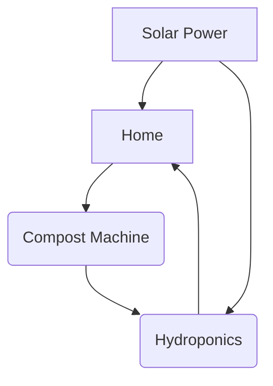

اسم المشروع: معاً من أجل إمارات أفضل

​الشعار: إماراتنا فخر نحو مستقبل أكثر استدامة.
​1. الملخص التنفيذي (Problem & Challenge)
​نحن في دولة الإمارات، وبفضل رؤية قيادتنا الرشيدة، نسعى دائماً للريادة. بينما توجد العديد من الحلول البيئية (مثل تدوير المياه أو الزراعة المائية) مطبقة بالفعل على نطاق فردي بسيط، يظل التحدي في غياب نموذج مجتمعي وطني متكامل يربط هذه الحلول ببعضها لخدمة الوطن.

​الابتكار في هذا المشروع:
نحن لا نقدم مجرد تقنيات؛ نحن نقدم منظومة عمل وطنية تهدف لرد الجميل لهذا الوطن المعطاء. الجديد هنا هو:
​التكامل: تطبيق ذكي واحد يربط كل الحلول (تدوير النفايات، تدوير المياه، الزراعة المائية، والطاقة الشمسية) في شبكة واحدة.
​الحافز المجتمعي: نظام مكافآت عادل للجميع؛ حيث يحصل المواطن على رصيد لسداد فواتيره، ويحصل العامل أو الخادم في المنزل على جزء مادي ملموس تقديراً لجهدهم، ليكونوا شركاء في العمل بضمير وإخلاص، بعيداً عن الشعور بأن هذا عمل زائد بلا مقابل.
​الهدف الوطني: المشروع يعزز التلاحم، ويجعل من الاستدامة ممارسة يومية نابعة من الروح الوطنية الأصيلة لرد جزء من الجميل للقيادة والوطن.
​التحدي: كيف نحول الممارسات الفردية إلى مشروع وطني ذكي يجعل من كل بيت في "منطقة القوع" نموذجاً للاستدامة والاكتفاء الذاتي؟

​2. الحل المقترح (The Solution)
​نقدم نظاماً ذكياً متكاملاً تديره شركة متخصصة تحت إشراف البلدية، يعتمد على أربعة محاور:
​إدارة النفايات العضوية والصلبة: تحويل نفايات الطعام والمخلفات الزراعية إلى سماد عضوي (Compost) باستخدام آلات التحلل السريع، وتدوير الزجاج والورق إلى مواد خام.
	
​الزراعة المائية الذكية (Hydroponics): توفير نظام زراعي متطور للمنازل، يربط السماد العضوي المستخلص بالإنتاج النباتي الطازج، مما يقلل النفقات.
​تدوير المياه الرمادية (Grey Water): فصل ومعالجة مياه المكيفات، المغاسل، ومياه الأمطار وإعادة استخدامها في الري، مما يوفر 50% من المياه العذبة.
​الاستقلال الطاقي الشامل: الاستثمار التدريجي في أنظمة الطاقة الشمسية لتشغيل المنزل بالكامل، مما يخفض فواتير الكهرباء بشكل ملموس.

​3. المجتمع المستهدف
​أهالي منطقة القوع، مع إشراك "العاملين والخدم" كشركاء أساسيين عبر نظام حوافز عادل يضمن التنفيذ الدقيق والمستدام، وتحفيز الشباب للمشاركة في إدارة هذا التحول.

​4. آلية التنفيذ والتقنية
​التطبيق الذكي (تطبيق "تم"): هو العقل المدبر. يربط صاحب المنزل بالعاملين والشركة المشرفة، ويحسب النقاط بدقة لكل مشارك.
​نظام الحوافز الوطنية: تحويل الالتزام بالتدوير إلى نقاط ملموسة (دفع فواتير، وقود، خصومات) لتعزيز الروح الوطنية والعمل الجماعي.
​التمويل الذاتي المستدام: يبدأ المشروع كاستثمار مدعوم، ثم تصبح عوائد المحاصيل الزراعية وتوفير الفواتير مصدراً لتمويل أنظمة الطاقة الشمسية للمنزل بالكامل، ليصبح البيت مستقلاً طاقياً ويصرف على نفسه دون تكلفة إضافية على المواطن.
​التنفيذ المرحلي: نبدأ بتجربة ميدانية في (10-20) منزلاً لقياس الأثر وتطوير الحلول التقنية قبل التعميم.

​5. الأثر الوطني والبيئي
​الهدف ليس ربحياً فقط، بل هو بناء مستقبل مستدام. المشروع يعزز التلاحم المجتمعي، ويخلق فرص عمل للكوادر الشابة في منطقة القوع، ويحول كل بيت إلى وحدة منتجة للطاقة والغذاء، مما يخفف العبء عن الشبكة الوطنية ويعزز من سيادة الدولة في مجالات الطاقة المستدامة. هذا النهج يضمن أن المشروع ليس مجرد عبء مالي، بل هو أصل اقتصادي مستدام يخدم الوطن.
