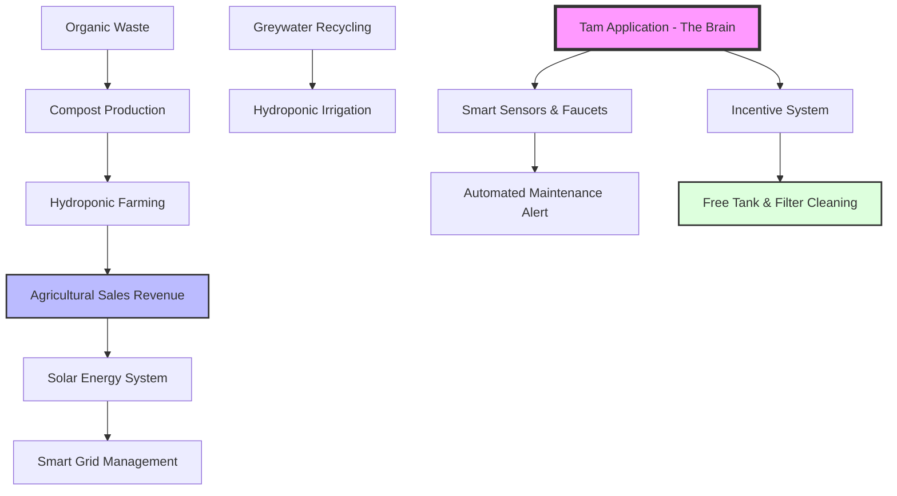

# Project Name: Together for a Better Emirates | معاً من أجل إمارات أفضل
**Slogan:** Our UAE, pride towards a more sustainable future | إماراتنا فخر نحو مستقبل أكثر استدامة.

---

## 1. Executive Summary | الملخص التنفيذي
**English:** We aim to create a national, integrated model where every home becomes a self-sustaining unit. By connecting waste management, water recycling, hydroponics, and solar energy, we transform individual efforts into a smart, community-driven sustainability grid.
**العربية:** نسعى لخلق نموذج وطني متكامل يجعل من كل منزل وحدة منتجة ومستدامة. من خلال ربط إدارة النفايات، تدوير المياه، الزراعة المائية، والطاقة الشمسية، نحول الممارسات الفردية إلى منظومة مجتمعية ذكية.

---

## 2. The Solution: A Smart Integrated Ecosystem | الحل المبتكر
**English:** Our platform transcends basic technology; it is a national operational system managed by the municipality, focusing on four pillars:
- **Waste-to-Resource:** Rapid conversion of organic waste into compost.
- **Hydroponic Farming:** Utilizing organic compost to produce fresh food, with surplus sales revenue funding solar energy systems.
  

- **Smart Greywater Recycling:** Reducing fresh water consumption by 50%.
- **Energy Independence:** Solar systems funded by the project’s agricultural returns.

**العربية:** لا نقدم مجرد تقنيات؛ بل منظومة عمل وطنية تشرف عليها البلدية، ترتكز على أربعة محاور:
- **إدارة النفايات:** تحويل سريع للمخلفات إلى سماد عضوي.
- **الزراعة المائية:** استغلال السماد لإنتاج طعام طازج، وتخصيص عوائد بيع الفائض لتمويل أنظمة الطاقة الشمسية.
- **تدوير المياه الرمادية:** توفير 50% من استهلاك المياه العذبة.
- **الاستقلال الطاقي:** أنظمة شمسية ممولة ذاتياً من عوائد الإنتاج الزراعي.

---

## 3. Smart Features & Social Incentives | المزايا الذكية والحوافز
**English:** We bridge the gap between technology and human action through:
- **Smart Hardware:** Automated faucets, occupancy-based lighting sensors to save energy, and intelligent filter maintenance systems.
- **Incentive Model:** A fair rewards system for homeowners and household staff (maids/workers). Compliance is rewarded with free professional tank and filter cleaning services, turning staff into dedicated partners.

**العربية:** نربط بين التكنولوجيا والممارسة الإنسانية عبر:
- **الأجهزة الذكية:** صنابير مياه آلية، حساسات إضاءة ذكية تغلق عند خلو الغرف، وأنظمة صيانة ذكية للفلاتر.
- **نموذج الحوافز:** نظام مكافآت عادل للمواطنين والعاملين في المنزل. الملتزمون يحصلون على خدمات صيانة مجانية (تنظيف خزانات وفلاتر)، مما يجعل الجميع شركاء في الاستدامة.

---

## 4. National Impact & Goals | الأثر الوطني
**English:** Starting as a pilot in "Al Qu'a", this project aims to create a self-financing sustainable asset. We reduce strain on national infrastructure while building community cohesion and creating jobs for youth.
**العربية:** نبدأ كنموذج تجريبي في "منطقة القوع"، بهدف خلق أصل مستدام يمول نفسه. نخفف العبء عن الشبكة الوطنية، نعزز التلاحم المجتمعي، ونخلق فرص عمل للشباب.

---

## 5. Technical Architecture | الهيكلية التقنية

